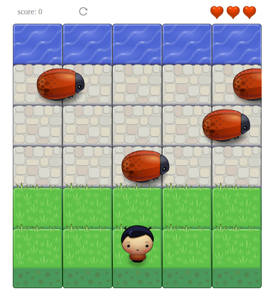

frontend-nanodegree-arcade-game
===============================

Classic Arcade Game is part of Udacity front-end nanodegree projects which brings focus on object oriented programming and its practices.

Play the game live here: https://i-mw.github.io/arcade-game

## Table of Contents

* [Game Logic](#game-logic)
* [Code Dependencies](#code-dependencies)
* [Contributing](contributing)

## Game Logic
* The player starts with 3 lives and 0 score
* Game win logic: the player crosses all the bugs untouched and reaches water. That adds 100 points to the player score
* Game lose logic: when the player is hit by one of the bugs. That deduct one life from him. If the player has more lives, he is reset to his start positions. If the player has no more lives -lives = 0- game ends and the player is shown his final score.

## Code Dependencies
The game depends on no outer libraries.

## contributing
As this project is part of a program and meant only for personal improvement, Its not open for contribution. But you can refer to a feature or a bug in Issues section.